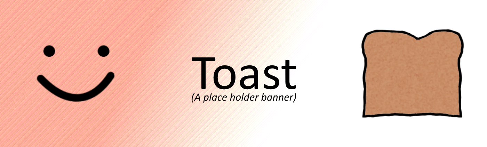

<h2 align="center">Hello there, Human. Welcome to my profile.</h2>
  

  
  
  
   
  
   
  

<h2 align="center">Who am I?</h2>

  I am just a kid that developed a love relationship towards coding. I most of my stuff 
  I do in my spare time, so response times can vary. 
  For some reason I'm obsessed with Toasts and Toaster (if that wasn't obvious).

  
<h3 align="center">My goals!</h3>
  

  I love Open-Source projects and my intent is to make stuff that is Open-Sourced and that can help other people. 
  I mostly develop libraries and Command-Line tools, although I do other stuff :)

<h2 align="center">Repository Showcase</h2>

    
    
    

  

    <h2>More stuff about me <h6><i>(Click me)</i></h6></h2>
  

  <h4 align="center">🚧Hello there, this part of the bio is under construction🚧<h4>

